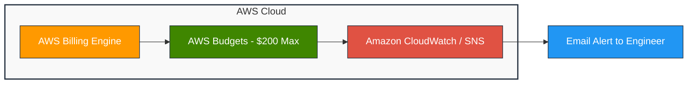
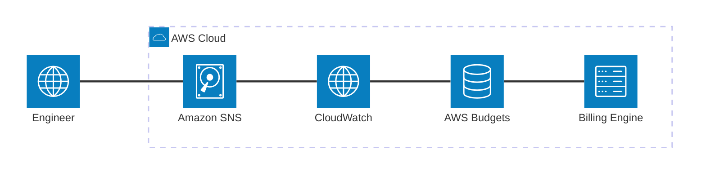

# FINOPS JOURNEY: SMART BUDGET MANAGEMENT FOR ONLINE AI PROJECTS ON AWS

When migrating the **AI Pulmonary Diagnostic Suite** medical imaging application from a local environment (Local/Kaggle) to the AWS cloud infrastructure, in addition to model packaging and API deployment, a major challenge for AI engineers is **Cost Management**.

Training server services such as Amazon SageMaker Training Jobs, SageMaker Studio, or high-configuration EC2 instances can easily incur significant costs if not closely managed and monitored. Therefore, adopting **FinOps (Financial Operations)** practices from the very beginning of the project is a vital key to ensuring the system operates reliably and stays strictly within the allocated $200 credit budget.

Key takeaways:

* **AWS Budgets:** Set a maximum $200 budget cap for the entire account and configure automated alert thresholds.
* **Amazon CloudWatch & SNS:** Real-time monitoring of cost consumption with immediate email alert notifications.
* **Toy Dataset Strategy:** Reduce training execution time from 45 minutes down to 1.5 minutes, saving over 90% in compute costs.
* **Automated Clean-up:** Utilize Bash scripts to auto-stop orphaned resources and prevent recurring background charges.

---

## 1. The Cost Challenge in AI/ML Projects

For medical imaging projects utilizing Deep Learning architectures (such as DenseNet121), the training and experimentation phase typically demands high computational resources:

* **Prolonged Training Time:** Training on the full original dataset of over 5,800 X-ray images causes SageMaker Training Jobs to run for hours, consuming a large portion of credits.
* **Risk of Orphaned Resources:** Test and staging services (such as EC2, RDS, or SageMaker Endpoints) left running due to forgotten clean-up after practical exercises will continuously incur real-time charges.

To address this challenge, the goal is to build a **multi-layered cost defense architecture**, ensuring the entire 8-week MLOps roadmap is successfully completed within the $200 credit budget.

---

## 2. Cost Control Solution Architecture

The automated cost control system is designed around three core AWS pillars:

1. **AWS Budgets (Overview Monitoring Layer):** Sets a maximum cost limit of $200 for the account and configures early warning thresholds.
2. **Amazon CloudWatch & SNS (Real-Time Alert Layer):** Automatically tracks budget consumption and delivers instant email alerts to operations engineers when spending crosses predefined limits.
3. **Toy Dataset Strategy (Resource Optimization Layer):** Downscales the test dataset (100–120 images) to shorten the execution time of SageMaker Processing/Training Jobs from 45 minutes to just 1.5 minutes, saving over 90% on server costs.

### Alert Workflow Diagram





### References:
[](https://docs.aws.amazon.com/awscostmanagement/)
[](https://aws.amazon.com/sagemaker/pricing/)

---

## 3. Practical Implementation Steps

### Step 1: Create an AWS Cost Budget
Access the **Billing and Cost Management** console, navigate to **Budgets**, and create a **Fixed Cost Budget** with a strict limit of **$200.00**. This budget acts as the primary "budget ceiling" to protect the account.

### Step 2: Configure Multi-Threshold Alerts
Instead of waiting until funds are fully depleted, the system is configured with 4 progressive alert thresholds:

* 🟢 **12.5% Threshold ($25):** Early warning upon completing initial IAM environment setup and S3 Bucket provisioning.
* 🟡 **25.0% Threshold ($50):** Track expenditures when initiating SageMaker Processing Jobs.
* 🟠 **50.0% Threshold ($100):** Peak phase monitoring when deploying SageMaker Real-time Endpoints.
* 🔴 **75.0% Threshold ($150):** Critical alert level triggering a full resource audit to terminate idle/forgotten services.

### Step 3: Automate Idle Resource Clean-up via Script
The Bash script below is configured to scan for and stop running EC2 instances tagged for auto-shutdown, avoiding idle running costs:

```bash
#!/bin/bash
# Automatically find and stop running EC2 Instances with tag AutoShutdown=yes
aws ec2 describe-instances \
  --filters "Name=tag:AutoShutdown,Values=yes" "Name=instance-state-name,Values=running" \
  --query 'Reservations[*].Instances[*].InstanceId' \
  --output text | xargs -r aws ec2 stop-instances
```

---

## 4. Key Results Achieved

* Daily cost fluctuations are visualized in real-time on the **AWS Billing Console**.
* Implementing the **Toy Dataset strategy** reduced SageMaker job execution times by **95%**, optimizing resource utilization.
* The system operated safely throughout the project; all experiment costs (EC2, RDS, Bedrock) remained strictly controlled and fully covered by available credits.

---

## 5. Lessons Learned

Adopting a **FinOps mindset** is not only crucial for financial protection when learning and experimenting on Cloud platforms, but also an essential core skill for professional MLOps engineers. Proactively cleaning up resources immediately after every lab session is a key factor that determines the sustainability and success of a project.
