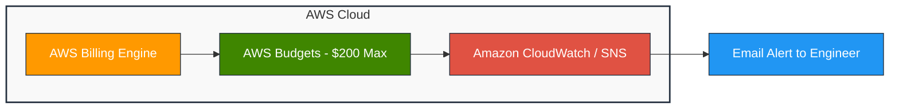
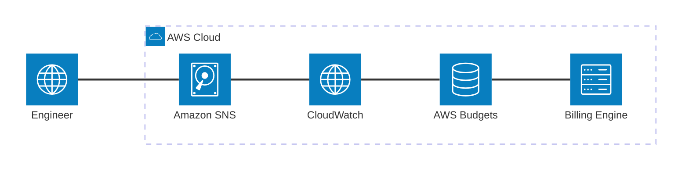

# HÀNH TRÌNH FINOPS: QUẢN LÝ NGÂN SÁCH THÔNG MINH CHO DỰ ÁN AI TRỰC TUYẾN TRÊN AWS

Trong quá trình dịch chuyển ứng dụng chẩn đoán hình ảnh y tế **AI Pulmonary Diagnostic Suite** từ môi trường cục bộ (Local/Kaggle) lên hạ tầng đám mây AWS, bên cạnh việc đóng gói mô hình hay triển khai API, một thách thức lớn đối với kỹ sư AI là **Quản lý chi phí (Cost Management)**.

Các dịch vụ máy chủ huấn luyện như Amazon SageMaker Training Jobs, SageMaker Studio hay các máy ảo EC2 cấu hình cao rất dễ phát sinh cước phí lớn nếu không được quản lý và theo dõi chặt chẽ. Do đó, việc ứng dụng thực hành **FinOps (Financial Operations)** ngay từ những ngày đầu khởi tạo dự án là chìa khóa sống còn giúp đảm bảo hệ thống vận hành ổn định và nằm gọn trong ngân sách $200 credit được cấp.

---

## 1. Bài toán chi phí trong các dự án AI/ML

Đối với các dự án xử lý ảnh y tế sử dụng mạng Deep Learning (như DenseNet121), quá trình huấn luyện và thử nghiệm thường đòi hỏi tài nguyên tính toán cao:

* **Thời gian huấn luyện kéo dài:** Nếu huấn luyện trên toàn bộ tập dữ liệu gốc gồm hơn 5.800 ảnh X-Quang, thời gian thực thi của SageMaker Training Job sẽ kéo dài hàng giờ, ngốn lượng lớn credit.
* **Rủi ro tài nguyên treo ngầm:** Các dịch vụ phục vụ kiểm thử (như EC2, RDS hay SageMaker Endpoints) nếu quên dọn dẹp (clean-up) sau khi thực hành sẽ tiếp tục bị tính phí theo thời gian thực.

Để giải quyết bài toán này, mục tiêu đặt ra là xây dựng một **kiến trúc phòng thủ chi phí đa lớp**, đảm bảo toàn bộ lộ trình MLOps 8 tuần hoàn thành trọn vẹn trong ngân sách $200 credit.

---

## 2. Kiến trúc giải pháp kiểm soát chi phí

Hệ thống kiểm soát chi phí tự động được thiết kế dựa trên ba trụ cột chính của AWS:

1. **AWS Budgets (Lớp giám sát tổng quan):** Đặt hạn mức chi phí tối đa $200 cho toàn bộ tài khoản và cấu hình các ngưỡng cảnh báo sớm.
2. **Amazon CloudWatch & SNS (Lớp cảnh báo thời gian thực):** Tự động theo dõi chi phí tiêu thụ và gửi email cảnh báo tức thì tới kỹ sư vận hành khi chi phí vượt mốc.
3. **Chiến lược Toy Dataset (Lớp tối ưu tài nguyên):** Thu nhỏ tập dữ liệu kiểm thử (100–120 ảnh) để rút ngắn thời gian thực thi của SageMaker Processing/Training Jobs từ 45 phút xuống còn 1.5 phút, tiết kiệm hơn 90% chi phí máy chủ.

### Sơ đồ luồng cảnh báo tự động (Alert Workflow Diagram)




### Tài liệu tham khảo:
[](https://docs.aws.amazon.com/awscostmanagement/)
[](https://aws.amazon.com/sagemaker/pricing/)

---

## 3. Các bước triển khai thực tế

### Bước 1: Khởi tạo AWS Cost Budget
Truy cập vào dịch vụ **Billing and Cost Management**, chọn mục **Budgets** và tiến hành tạo một **Fixed Cost Budget** với hạn mức cố định là **$200.00**. Budget này giữ vai trò là "trần ngân sách" bảo vệ tài khoản.

### Bước 2: Cấu hình đa ngưỡng cảnh báo (Multi-threshold Alerts)
Thay vì chờ tới khi tài khoản tiêu hết tiền mới xử lý, hệ thống được cấu hình phân chia thành 4 ngưỡng cảnh báo lũy tiến:

* 🟢 **Ngưỡng 12.5% ($25):** Cảnh báo sớm sau khi hoàn thành thiết lập môi trường IAM và S3 Bucket.
* 🟡 **Ngưỡng 25.0% ($50):** Theo dõi chi phí khi bắt đầu chạy các lệnh SageMaker Processing Jobs.
* 🟠 **Ngưỡng 50.0% ($100):** Ngưỡng cao điểm khi triển khai SageMaker Real-time Endpoint.
* 🔴 **Ngưỡng 75.0% ($150):** Mức báo động đỏ, kích hoạt quy trình kiểm tra toàn bộ tài nguyên (Audit) để dọn dẹp các tài nguyên quên tắt.

### Bước 3: Tự động hóa quét tài nguyên thừa bằng Script
Đoạn script Bash dưới đây được thiết lập để tự động quét và dừng các máy chủ EC2 có gắn tag dọn dẹp nhằm tránh phát sinh chi phí treo máy:

```bash
#!/bin/bash
# Tự động tìm và dừng các EC2 Instance đang chạy có tag AutoShutdown=yes
aws ec2 describe-instances   --filters "Name=tag:AutoShutdown,Values=yes" "Name=instance-state-name,Values=running"   --query 'Reservations[*].Instances[*].InstanceId'   --output text | xargs -r aws ec2 stop-instances
```

---

## 4. Kết quả đạt được

* Toàn bộ biến động chi phí tiêu thụ hàng ngày được trực quan hóa theo thời gian thực trên **AWS Billing Console**.
* Nhờ áp dụng chiến lược dữ liệu thu nhỏ (Toy Dataset), thời gian chạy máy chủ SageMaker **giảm 95%**, tiết kiệm tối đa nguồn lực.
* Hệ thống vận hành an toàn, mọi chi phí thử nghiệm (EC2, RDS, Bedrock) đều nằm trong tầm kiểm soát và được bao phủ hoàn toàn bởi credit khả dụng.

---

## 5. Bài học rút ra

Tư duy **FinOps** không chỉ giúp bảo vệ tài chính khi học tập và thử nghiệm trên Cloud, mà còn là kỹ năng cốt lõi bắt buộc phải có đối với một kỹ sư MLOps chuyên nghiệp. Việc chủ động dọn dẹp tài nguyên (Clean-up) ngay sau mỗi bài thực hành là thói quen quyết định sự thành công và tính bền vững của dự án.
