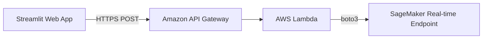

# Deploying a Real-Time AI Diagnostic API: Packaging a Secure SageMaker Real-Time Endpoint with AWS Lambda and Amazon API Gateway

Hello everyone!

After migrating our X-ray data to Amazon S3 and completing the DenseNet121 model training via SageMaker Training Jobs, the next critical challenge in our MLOps workflow is: **How can we serve real-time predictions to our Streamlit Web Application in the most secure and optimized manner?**

In real-world medical applications, embedding model weight files (`.keras` or `.tflite`) directly within the web app's source code introduces severe security and operational risks:
* **Intellectual Property Exposure:** Model weight files can be downloaded or tampered with without authorization.
* **Heavy Burden on the Web Server:** The web server must handle user interfaces while simultaneously loading a model weighing hundreds of megabytes into RAM for inference, causing performance bottlenecks and hindering scalability.

In this article, I will share our solution for packaging the model into an enterprise-grade **Serverless REST API**, completely securing the model while decoupling the Web application from the underlying AI infrastructure.

---

## 1. End-to-End Serverless Inference Architecture

Instead of allowing the Web application to invoke the model directly, the system was designed following a **Decoupled Security Architecture** consisting of 3 primary components:

1. **SageMaker Real-Time Endpoint (Core Compute Engine):** Packages the `pneumonia_model_finetuned.keras` model from SageMaker Model Registry and maintains a dedicated inference environment.
2. **AWS Lambda (Secure Middleware Proxy):** Acts as a security bridge. The Lambda function receives image payloads from the Web app, handles preprocessing, invokes the SageMaker Endpoint via the `boto3` SDK, and returns the diagnostic results.
3. **Amazon API Gateway (REST API Interface):** Exposes a public HTTPS URL for the Streamlit Web Application (`app.py`) to send diagnostic requests without exposing underlying AWS Credentials.



---

## 2. Practical Implementation Steps

### Step 1: Model Versioning & SageMaker Endpoint Deployment
Once verified, the trained model is registered into the SageMaker Model Registry and marked as Approved. From there, a SageMaker Endpoint is initialized for real-time predictions:

```python
import boto3
import sagemaker
from sagemaker.tensorflow import TensorFlowModel

# Configure Model Deployment from S3 Artifact
sagemaker_model = TensorFlowModel(
    model_data='s3://ai-pulmonary-data-bucket/output/model.tar.gz',
    role=role,
    framework_version='2.13.0'
)

# Provision Real-Time Endpoint with a minimal instance type for cost efficiency
predictor = sagemaker_model.deploy(
    initial_instance_count=1,
    instance_type='ml.m5.large', # Low-cost CPU instance
    endpoint_name='pulmonary-diagnostic-endpoint'
)
```

### Step 2: Developing the AWS Lambda Secure Proxy
The Lambda function receives X-ray image arrays or Base64 strings from API Gateway, processes the payload, and invokes the endpoint:

```python
import json
import boto3
import numpy as np

# Initialize SageMaker Runtime Client
runtime = boto3.client('sagemaker-runtime')
ENDPOINT_NAME = 'pulmonary-diagnostic-endpoint'

def lambda_handler(event, context):
    try:
        # Extract image payload sent from the Web App
        body = json.loads(event['body'])
        img_payload = body['image_data'] # X-ray pixel array
        
        # Invoke SageMaker Endpoint for prediction
        response = runtime.invoke_endpoint(
            EndpointName=ENDPOINT_NAME,
            ContentType='application/json',
            Body=json.dumps({"instances": img_payload})
        )
        
        result = json.loads(response['Body'].read().decode())
        
        # Return diagnostic results to the Web App
        return {
            'statusCode': 200,
            'headers': {
                'Content-Type': 'application/json',
                'Access-Control-Allow-Origin': '*' # CORS Header
            },
            'body': json.dumps({'prediction': result})
        }
    except Exception as e:
        return {
            'statusCode': 500,
            'body': json.dumps({'error': str(e)})
        }
```

### Step 3: Integrating API Gateway with Streamlit Web App
In the Amazon API Gateway console, a POST method is created to connect to the Lambda function with CORS enabled. In `app.py`, instead of loading a local model file, the application simply calls the REST API:

```python
import requests

# Public REST API URL provided by API Gateway
API_URL = "https://xyz123.execute-api.ap-southeast-1.amazonaws.com/prod/predict"

def predict_via_api(image_array):
    payload = {"image_data": image_array.tolist()}
    response = requests.post(API_URL, json=payload)
    return response.json()
```

---

## 3. FinOps Strategy & Resource Clean-up
Because SageMaker Endpoints incur charges for the duration they remain active, we enforced a strict strategy to stay within our $200 credit budget:

* **On-Demand Endpoint Execution:** Enable the endpoint strictly during testing, sending 5–10 diagnostic requests via Postman or the Web App to record response logs for the final report.
* **Immediate Deletion:** Immediately following test execution, terminate the endpoint via the SDK or AWS Console to halt running costs:

```python
# Command to immediately delete the Endpoint and safeguard budget
predictor.delete_endpoint()
```

---

## 4. Key Results Achieved & Practical Value
* **Absolute Security:** Model weights are completely hidden behind AWS infrastructure layers; the Web app interacts exclusively via encrypted HTTPS REST API calls.
* **Seamless Scalability:** Leveraging the Serverless model of Lambda and API Gateway, the architecture can handle thousands of concurrent diagnostic requests without impacting Web app performance.
* **Cost Optimization:** Combining an on-demand endpoint activation strategy ensured real-time diagnostic API testing cost less than **$1.00 credit** overall!

#AWS #AmazonSageMaker #AWSLambda #APIGateway #Serverless #MLOps #FinOps #AIHealthcare #DeepLearning #FirstCloudJourney
