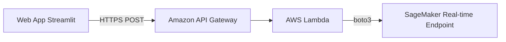

# Triển Khai API Chẩn Đoán AI Thời Gian Thực: Đóng Gói SageMaker Real-Time Endpoint Bảo Mật Với AWS Lambda Và Amazon API Gateway

Xin chào mọi người!

Sau khi đã chuyển dịch dữ liệu X-Quang lên Amazon S3 và hoàn thành quá trình huấn luyện mô hình DenseNet121 bằng SageMaker Training Jobs, bài toán quan trọng tiếp theo trong quy trình MLOps là: **Làm sao để phục vụ dự đoán thời gian thực (Real-time Inference) cho ứng dụng Web Streamlit một cách an toàn và tối ưu nhất?**

Trong các ứng dụng y tế thực tế, việc lưu trực tiếp file trọng số mô hình (`.keras` hay `.tflite`) trong source code web app lộ ra nhiều rủi ro nghiêm trọng về bảo mật:
* **Lộ bản quyền thuật toán:** File trọng số mô hình có thể bị tải về hoặc can thiệp trái phép.
* **Gánh nặng cho ứng dụng Web:** Web server vừa phải xử lý giao diện người dùng, vừa phải tải mô hình nặng hàng trăm MB vào RAM để chạy suy luận, gây chậm lag và khó mở rộng quy mô.

Trong bài viết này, mình xin chia sẻ giải pháp đóng gói mô hình thành một **REST API Serverless** chuẩn doanh nghiệp, giúp bảo mật tuyệt đối mô hình và tách biệt hoàn toàn giữa ứng dụng Web với hạ tầng AI.

---

## 1. Kiến trúc Serverless Inference End-to-End

Thay vì cho ứng dụng Web gọi thẳng vào mô hình, hệ thống được thiết kế theo mô hình phân lớp bảo mật (**Decoupled Architecture**) gồm 3 thành phần chính:

1. **SageMaker Real-Time Endpoint (Trái tim tính toán):** Đóng gói mô hình `pneumonia_model_finetuned.keras` từ SageMaker Model Registry và duy trì một môi trường suy luận riêng biệt.
2. **AWS Lambda (Hàm xử lý trung gian):** Đóng vai trò là "cầu nối bảo mật". Hàm Lambda nhận dữ liệu ảnh từ Web, tiền xử lý, gọi đến SageMaker Endpoint qua SDK `boto3` và trả về kết quả chẩn đoán.
3. **Amazon API Gateway (Cổng giao tiếp REST API):** Mở ra một đường dẫn HTTPS công khai để ứng dụng Web Streamlit (`app.py`) gửi yêu cầu chẩn đoán mà không làm lộ các thông tin xác thực AWS (AWS Credentials).


---

## 2. Các bước triển khai thực tế
**Bước 1: Quản lý phiên bản & Triển khai SageMaker Endpoint**
Mô hình sau khi đạt chuẩn được đăng ký vào SageMaker Model Registry và gán nhãn Approved. Từ đó, một SageMaker Endpoint được khởi tạo phục vụ dự đoán thời gian thực:

```python
import boto3
import sagemaker
from sagemaker.tensorflow import TensorFlowModel

# Cấu hình Deploy Model từ Artifact trên S3
sagemaker_model = TensorFlowModel(
    model_data='s3://ai-pulmonary-data-bucket/output/model.tar.gz',
    role=role,
    framework_version='2.13.0'
)

# Kích hoạt Real-time Endpoint với cấu hình máy chủ nhỏ nhất để tiết kiệm chi phí
predictor = sagemaker_model.deploy(
    initial_instance_count=1,
    instance_type='ml.m5.large', # Dòng máy CPU giá rẻ
    endpoint_name='pulmonary-diagnostic-endpoint'
)
```
**Bước 2: Viết hàm trung gian AWS Lambda (Secure Proxy)**
Hàm Lambda nhận ảnh X-Quang dạng chuỗi mã hóa Base64 hoặc mảng Pixel từ API Gateway, xử lý dữ liệu và gọi Endpoint:

```python
import json
import boto3
import numpy as np

# Khởi tạo client kết nối SageMaker Runtime
runtime = boto3.client('sagemaker-runtime')
ENDPOINT_NAME = 'pulmonary-diagnostic-endpoint'

def lambda_handler(event, context):
    try:
        # Lấy dữ liệu ảnh gửi lên từ Web App
        body = json.loads(event['body'])
        img_payload = body['image_data'] # Mảng pixel ảnh X-Quang
        
        # Gọi SageMaker Endpoint phục vụ dự đoán
        response = runtime.invoke_endpoint(
            EndpointName=ENDPOINT_NAME,
            ContentType='application/json',
            Body=json.dumps({"instances": img_payload})
        )
        
        result = json.loads(response['Body'].read().decode())
        
        # Trả về kết quả chẩn đoán cho Web App
        return {
            'statusCode': 200,
            'headers': {
                'Content-Type': 'application/json',
                'Access-Control-Allow-Origin': '*' # CORS Header
            },
            'body': json.dumps({'prediction': result})
        }
    except Exception as e:
        return {
            'statusCode': 500,
            'body': json.dumps({'error': str(e)})
        }
```

**Bước 3: Tích hợp API Gateway vào Web App Streamlit**
Trên giao diện Amazon API Gateway, tạo một POST method kết nối tới hàm Lambda vừa viết và kích hoạt CORS. Trong mã nguồn app.py, thay vì tải model cục bộ, ứng dụng gọi REST API một cách đơn giản:

```python
import requests

# Link REST API công khai do API Gateway cấp
API_URL = "https://xyz123.execute-api.ap-southeast-1.amazonaws.com/prod/predict"

def predict_via_api(image_array):
    payload = {"image_data": image_array.tolist()}
    response = requests.post(API_URL, json=payload)
    return response.json()
```
---

## 3. Chiến lược FinOps & Dọn dẹp tài nguyên (Clean-up)
Do SageMaker Endpoint tính phí theo thời gian duy trì máy chủ, để đảm bảo không vượt quá ngân sách $200 credit:

* **Chỉ bật Endpoint khi kiểm thử:** Tiến hành bật Endpoint, dùng Postman hoặc Web App gửi 5–10 request chẩn đoán để ghi lại log/kết quả làm báo cáo.
* **Thao tác xóa tức thì:** Ngay sau khi hoàn thành kiểm thử, tiến hành xóa (Delete) Endpoint ngay lập tức qua SDK hoặc Console để ngừng tính cước phí:

```python
# Lệnh xóa Endpoint tức thì để bảo vệ ngân sách
predictor.delete_endpoint()
```
---

## 4. Kết quả đạt được & Giá trị thực tế
* **Bảo mật tuyệt đối:** Trọng số mô hình được giấu kín hoàn toàn đằng sau lớp hạ tầng AWS, ứng dụng Web chỉ tương tác qua HTTPS REST API mã hóa.
* **Mở rộng linh hoạt (Scalability):** Nhờ mô hình Serverless của Lambda và API Gateway, hệ thống có thể tiếp nhận hàng nghìn lượt yêu cầu chẩn đoán đồng thời mà không làm sập Web App.
* **Tối ưu chi phí:** Kết hợp chiến lược bật/tắt Endpoint linh hoạt giúp chi phí triển khai API chẩn đoán thời gian thực chỉ tốn dưới $1.00 credit cho toàn bộ quá trình kiểm thử!

#AWS #AmazonSageMaker #AWSLambda #APIGateway #Serverless #MLOps #FinOps #AIHealthcare #DeepLearning #FirstCloudJourney
